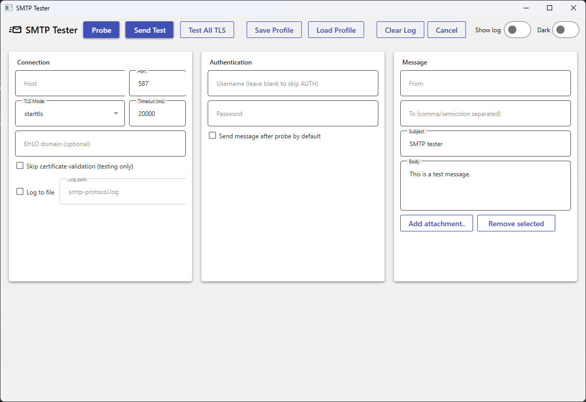

# SMTP Tester

A fast, modern SMTP **probe & test** tool for Windows using **MailKit**.  
Connect to an SMTP/MX server, negotiate TLS (STARTTLS/SSL), optionally authenticate, and send a test message with attachments. The app shows a live transcript and timings, and can save the full protocol log to a file.

> 

---

## 🤝 Contributing

Issues and PRs are welcome!  
If you add a feature, please include a brief demo and update this README.

---

## 📄 License

MIT — see [LICENSE](LICENSE).

---

## 🙏 Acknowledgements

- [MailKit](https://github.com/jstedfast/MailKit)  
- [MaterialDesignInXamlToolkit](https://github.com/MaterialDesignInXAML/MaterialDesignInXamlToolkit)
